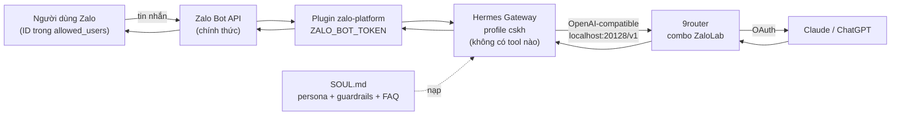
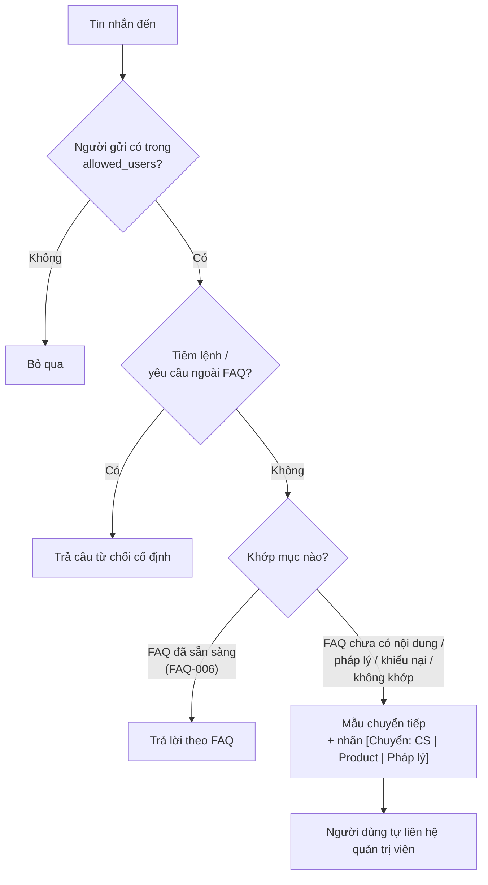
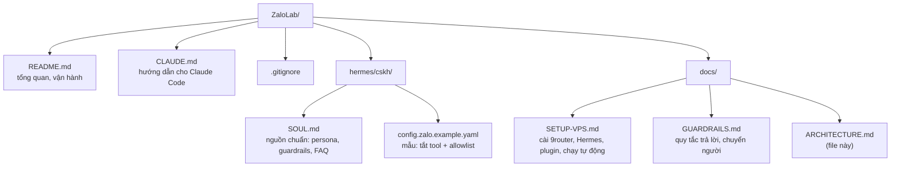
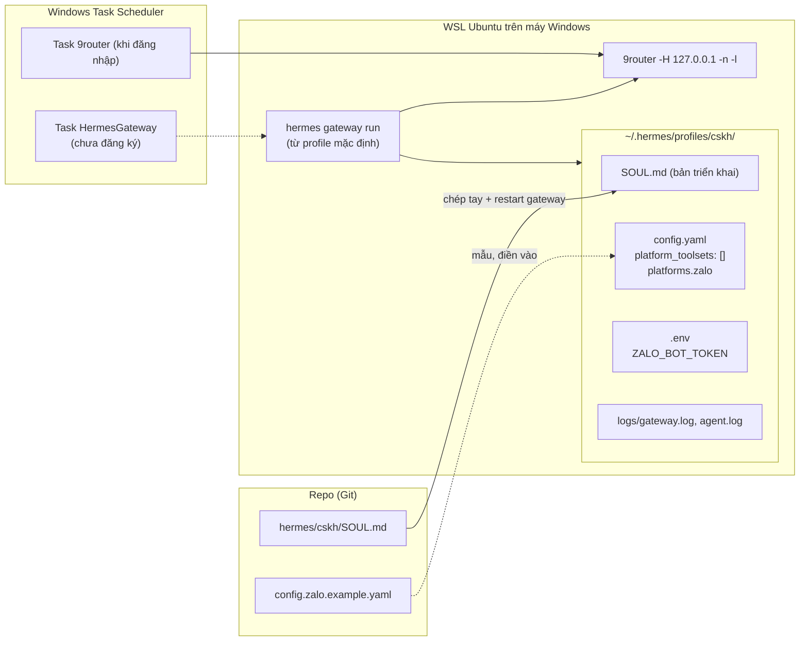

# Cấu trúc dự án ZaloLab

Sơ đồ Mermaid, xem được trực tiếp trong VS Code (xem trước Markdown có hỗ trợ Mermaid) hoặc GitHub.

## 1. Luồng hoạt động của bot

## 2. Quy trình bot xử lý một câu hỏi

## 3. Cấu trúc thư mục

## 4. Thành phần chạy ngoài repo (WSL Ubuntu)

## 5. Lịch sử và việc còn dở

| Hạng mục | Trạng thái |
|---|---|
| Bot cũ `bot.js` (`zca-js`, nhận file, trích xuất `.xlsx`) | Đã gỡ, bản cuối ở commit `03e5478` |
| FAQ-006 | Có câu trả lời |
| FAQ-001 đến 004, câu "AI luật ban hành dựa trên công văn nào" | Chỉ chuyển tiếp, chờ nội dung duyệt |
| FAQ-005 | Đã hủy, không dùng |
| Báo admin tự động khi chuyển tiếp | Chưa có (bot không có tool) |
| Task `HermesGateway` tự chạy khi đăng nhập | Chưa đăng ký |
| Hành vi trong nhóm Zalo | Chưa kiểm chứng |
